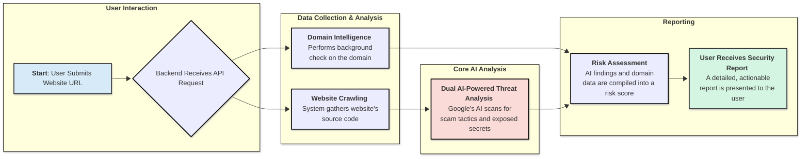

# ScamScanner

ScamScanner is an AI-powered tool that analyzes a website's source code to detect potential scam tactics, phishing attempts, exposed secrets, and other malicious activities. It features a full-stack architecture with a React frontend and a FastAPI backend, all containerized with Docker for easy setup and use.

## Features

- **Multi-faceted AI Analysis**: Leverages Google's Gemini API for two distinct scans: one for general security threats (phishing, malicious scripts) and another specifically for exposed secrets (API keys, credentials).
- **Recursive Web Crawler**: Intelligently crawls the target website, downloading relevant HTML and JavaScript content from the same domain while ignoring unnecessary files like images and stylesheets.
- **Domain Intelligence**: Performs a WHOIS lookup on the target domain to provide crucial context like domain age and registrar information, which are key indicators of a site's legitimacy.
- **Real-time Progress Updates**: Uses WebSockets to provide a live log of the crawling and analysis process, so you're never left wondering what's happening.
- **Complete Analysis History**: All scan results are saved to a database and can be viewed on a dedicated history page.
- **Flexible Input**: Analyze websites via a live URL or by manually pasting or uploading source code.
- **Downloadable Reports**: Export your detailed analysis results as either a Markdown or a plain text file.

## Workflow Diagram



## Tech Stack

- **Backend**:
  - Python 3.12
  - FastAPI (for the web framework)
  - SQLModel (combined SQLAlchemy and Pydantic)
  - `python-whois` (for domain lookups)
  - Uvicorn & Gunicorn (as the ASGI server)
  - Google GenAI (for AI-driven insights)
- **Frontend**:
  - React (with TypeScript)
  - Vite (for the build tooling)
  - Tailwind CSS (for styling)
  - React Router (for page navigation)
- **Database**:
  - SQLite
- **Containerization**:
  - Docker & Docker Compose

## Getting Started

Run the application locally with Docker.

### Prerequisites

- **Docker**: Ensure you have [Docker](https://docs.docker.com/get-docker/) and Docker Compose installed on your system.

### Environment Setup

You need to provide your Google Gemini API key for the backend to function.

1.  In the root directory of the project, create a file named `.env.local`.

2.  Add your API key to this file:

    ```
    # .env.local
    GEMINI_API_KEY="YOUR_GEMINI_API_KEY_HERE"
    ```

### Installation & Running

From the root directory of the project, run the following command:

```bash
docker-compose up --build
```

This will build the Docker images for both the frontend and backend, install all dependencies, and start the services.

Once the containers are running, you can access the application:

- **Frontend**: [http://localhost:5173](https://www.google.com/search?q=http://localhost:5173)
- **Backend API**: [http://localhost:8000](https://www.google.com/search?q=http://localhost:8000)

## How to Use

1.  Navigate to the **Scanner** page.
2.  Enter a full website URL into the input field and click "Scan Website". If you are unsure or want to scan our test sites, you can enter `demo-scan.com` or `demo-safe.com` and run the scan.
3.  Watch the real-time progress log as the application crawls and analyzes the site.
4.  Once complete, review your detailed report on the results screen.
5.  Visit the **History** page to see a list of all your previous scans.
