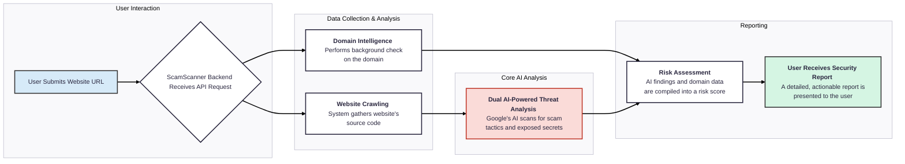

```mermaid
---
config:
  theme: redux
  layout: dagre
---

flowchart LR
 subgraph subGraph0["User Interaction"]
        B{"ScamScanner Backend Receives API Request"}
        A["User Submits Website URL"]
  end
 subgraph subGraph1["Data Collection & Analysis"]
        C@{ label: "<b>Website Crawling</b> <br> System gathers website's source code" }
        D["<b>Domain Intelligence</b> <br> Performs background check on the domain"]
  end
 subgraph subGraph2["Core AI Analysis"]
        E@{ label: "<b>Dual AI-Powered Threat Analysis</b> <br> Google's AI scans for scam tactics and exposed secrets" }
  end
 subgraph Reporting["Reporting"]
        F["<b>Risk Assessment</b><br> AI findings and domain data are compiled into a risk score"]
        G["<b>User Receives Security Report</b> <br> A detailed, actionable report is presented to the user"]
  end
    A --> B
    B --> C & D
    C --> E
    D --> F
    E --> F
    F --> G
    C@{ shape: rect}
    D@{ shape: rect}
    E@{ shape: rect}
    style A fill:#D6EAF8,stroke:#333,stroke-width:2px
    style E fill:#FADBD8,stroke:#C0392B,stroke-width:2px
    style G fill:#D5F5E3,stroke:#333,stroke-width:2px
```
